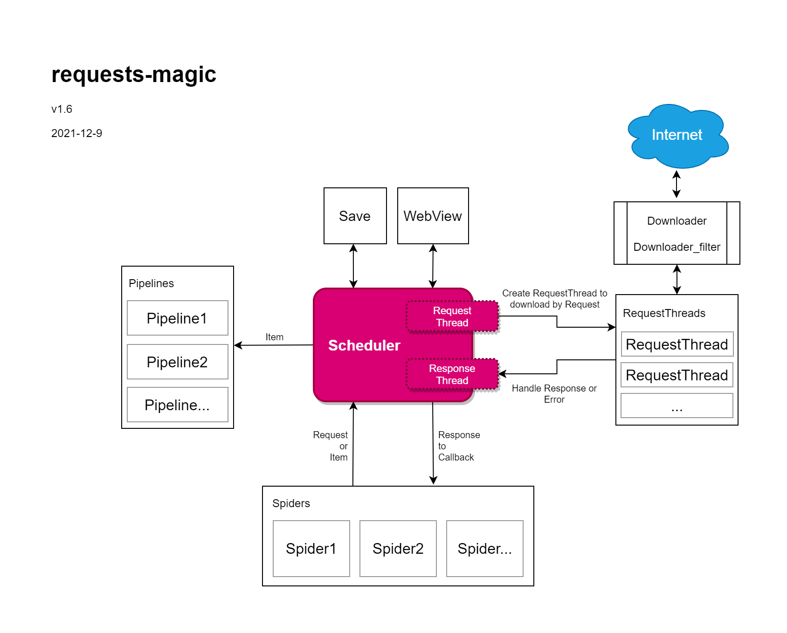

# requests-magic

效仿 scrapy 制作的极简爬虫框架

-----

### 特点

- 多线程下载
- 下载中间件、下载过滤器
- Pipeline ← Item ← Scheduler ↔ Request ↔ Spider
- 极简的代码
- 默认下载件基于 requests

### 极速入门

开始工作就是继承 Spider 实现一个你的爬虫类

调用 quick_start 方法开始爬虫

```python
import requests_magic as rm
from requests_magic.pipeline import SimpleFilePipeline


class MySpider(rm.Spider):
    ...


rm.quick_start(MySpider(), SimpleFilePipeline())
```

重写 Spider 的 start 方法开始第一个请求，默认会在 parse 方法中处理结果：

```python
import requests_magic as rm


class MySpider(rm.Spider):
    def start(self):
        yield rm.Request("http://balabala.com", callback=self.parse)

    def parse(self, result, request):
        yield rm.Item(result.text, tags={'file': './out.data'})
```

可以使用 yield 返回多个 Request 或 Item，也可以用 return 只返回一个

SimpleFilePipeline 默认会根据 Item 中 tags 的 file 保存文件，或者也可以自己写一个类似功能的管道：

```python
import requests_magic as rm


class MyPipeline(rm.Pipeline):
    def save(self, item):
        with open(item._tags['file'], 'w') as f:
            f.write(str(item))  
```

### 关于架构

相比 scrapy ，省掉了好多东西（因为懒得写）



### 日后计划

整一个 web 监控页面，可以查看爬虫情况

