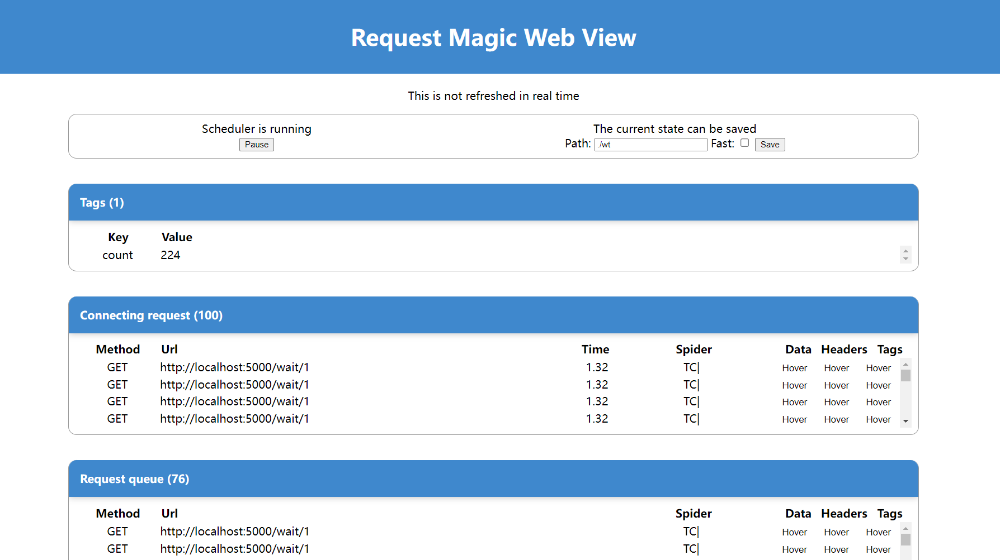

# requests-magic

效仿 scrapy 制作的爬虫框架

-----

### 特点

- 简单易学

- 多线程下载

- 可随时`暂停`、`保存`、`读取`爬取状态

- Web 监控页面（基于 bottle.py，已内嵌）

- 下载中间件、下载过滤器、预解析器

- Pipeline ← Item ← Scheduler ←→ Request ←→ Spider

- 默认下载件基于 requests

- 只依赖 requests 模块，甚至简单修改即可取消依赖 requests。

### 极速入门

开始工作就是继承 Spider 实现一个你的爬虫类

```python
import requests_magic as rm


class MySpider(rm.Spider):

    def start(self):
        # start 方法会在一开始调用
        yield rm.Request(url='http://balabalaba.com', callback=self.parse)

    def parse(self, result, request):
        # yield 一个 item 就是持久化数据，或者 yield 一个 Request 发起新的请求
        yield rm.Item(data={'text': result.text}, tags={'file': 't.txt'})
```

看起来和 Scrapy 一模一样是不是。

最后弄一个调度器开始爬虫：

```python
rm.Scheduler(MySpider, rm.SimpleFilePipeline, web_view=3344).start()
# web_view 可以在 3344 端口开启一个 web 页面用来监控爬虫状态
# 第一个参数表示爬虫，可以传进去一个列表，多个爬虫同时工作
# 第二个参数表示管道，可以传进去一个列表，多个管道同时保存
```

SimpleFilePipeline 默认会根据 Item 中 tags 的 file 保存文件，或者也可以自己写一个简单的文件保存：

```python
import requests_magic as rm


class MyPipeline(rm.Pipeline):
    def save(self, item):
        with open(item.tags['file'], 'w') as f:
            f.write(str(item))  
```

### 可持久化特性

在爬取过程中，可以随时调用 Scheduler 的 save 方法保存当前爬虫状态。

例如在你的 Spider 解析方法中：

```python
def parse(result, response):
    # 这个 count 是调度器的 tags
    self.scheduler['count'] += 1  # 每解析一个请求结果 count 加一
    if self.scheduler['count'] == 100:
        # 快速保存状态，fast=True 会取消正在下载中的请求
        self.scheduler.save('./save_dir', fast=True)
```

保存后如果需要继续可以直接 `self.scheduler.pause = False`，想日后再爬那就可以关闭直接 python 了。

某天你想继续下载你的东西，那么打开你的项目，把之前的 Scheduler 的 start 方法调用处加上参数:

```python
import requests_magic as rm

...
scheduler = rm.Scheduler(你之前的配置)
# 这会读取这个目录的状态并开始爬虫，默认将跳过 Spider 的 start 方法
scheduler.start(load_from='./save_dir')
# 这个 load_from 参数会记录下来，如果你的 save 没有指定目录，则会使用 start 的 load_from
```

这个 load_from 所指的目录可以不存在，如果不存在则和正常的 start 效果相同，因此这个参数可以在一开始就加上。

保存操作将保存 待请求列表、已经添加的请求MD5（用于去重）、调度器的 tags 和 用于读取验证的 Spider、Pipeline 列表。

### Web 页面

默认不开启 web 页面，Scheduler 的实例化参数中有 web_view 可以开启 web 页面。

在页面中可以查看请求列表，可以控制调度器暂停、保存



### 关于架构

相比 scrapy ，省掉了好多东西（因为懒得写）


